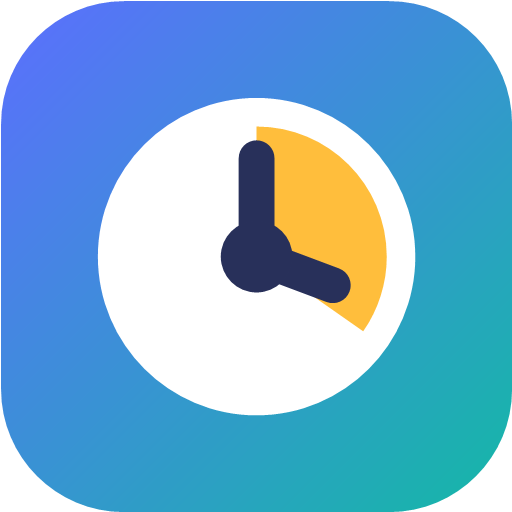
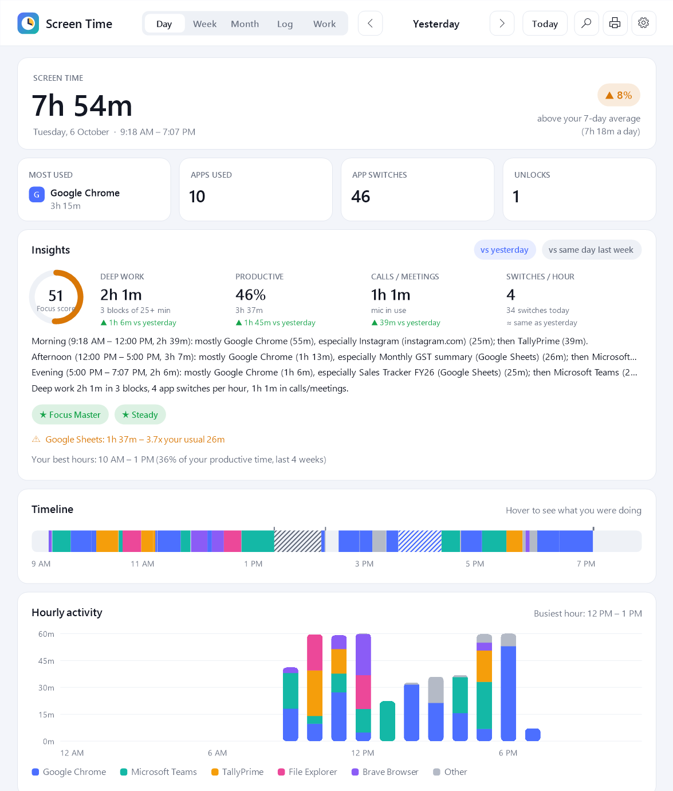
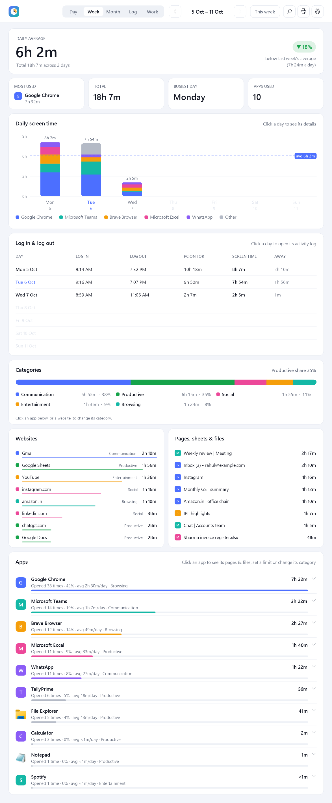
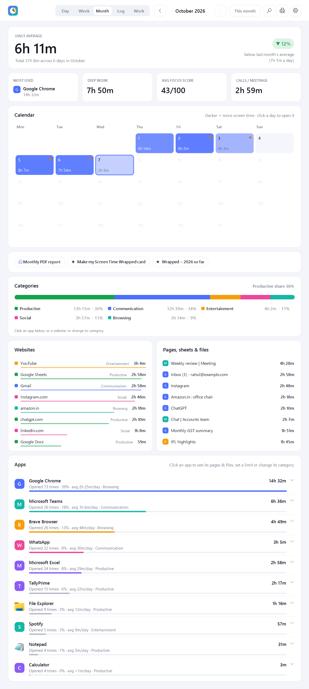
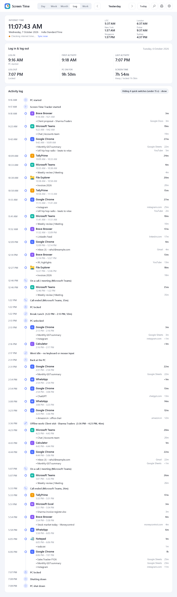
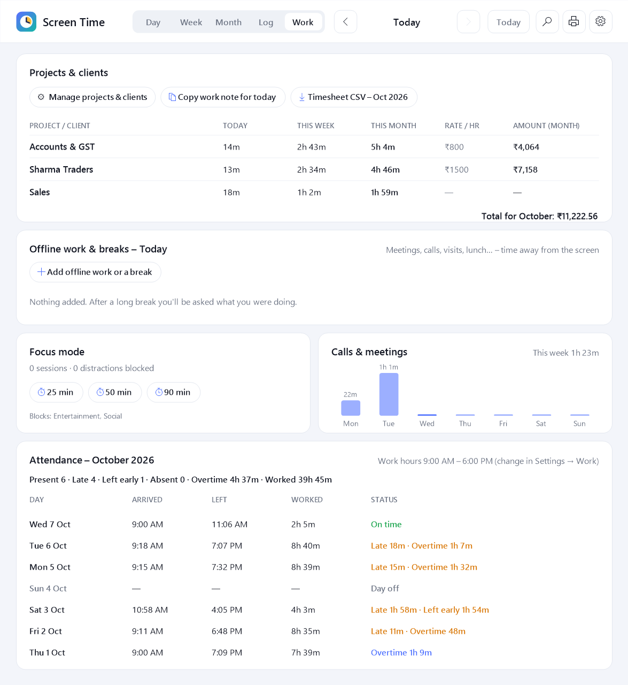
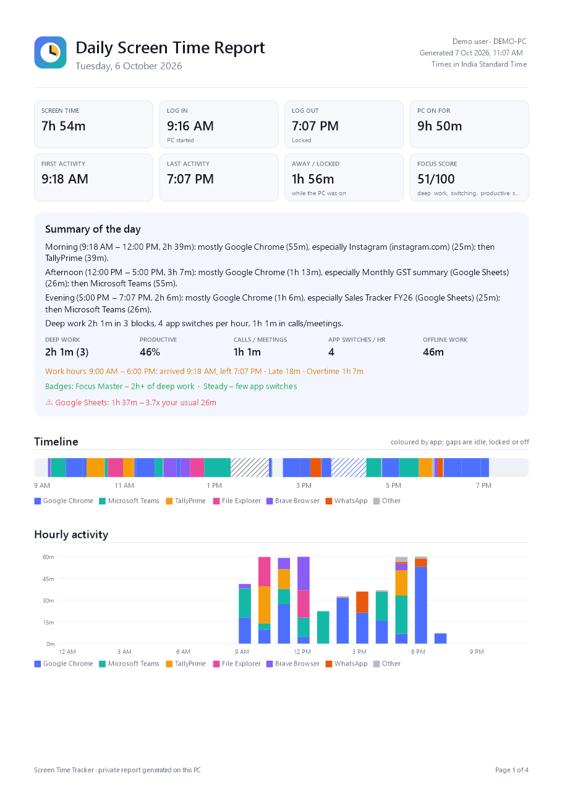
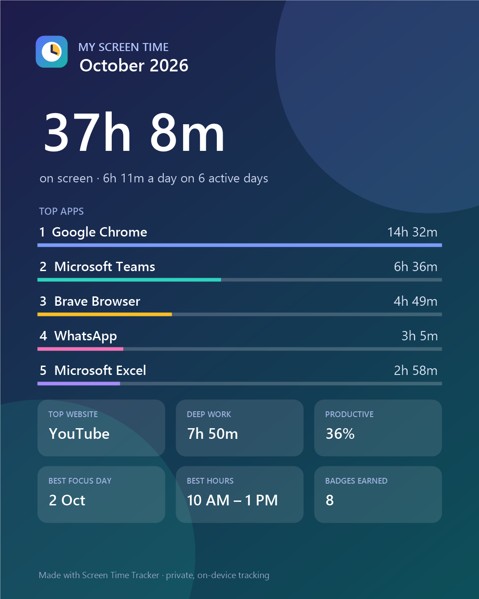

# Screen Time Tracker

### See where your day really goes.

A free, private app for Windows that shows **how long you use your PC**: every app, website, Google Sheet and file, plus **when you logged in and out**. Open it any time, or get a neat **PDF report of any day**.

 

&nbsp;

Windows 10 &amp; 11 · No account · No admin rights needed · Everything stays on your PC

  

---

## ✨ What can it do?

| | |
|---|---|
| ⏱️ **Time on every app** | Chrome, Brave, Excel, Tally, WhatsApp, even Calculator: how long, how often, and when |
| 🌐 **Websites & Google Sheets** | Not just "Chrome", but which website, which sheet and which file you were actually on |
| 🕘 **Log-in & log-out times** | When the PC started, when you began working, when you stopped, every day |
| 📄 **PDF report of any day** | One click gives a clean report for today, any day, a week or a month |
| 📊 **Day, Week, Month views** | Timeline, charts, calendar and a full activity log. Hover over anything for details |
| 🎯 **Focus mode** | Hides YouTube, Instagram and other distractions for 25, 50 or 90 minutes |
| 💼 **Clients & timesheets** | Turns screen time into hours per client, with amounts at your hourly rate |
| ✅ **Attendance** | Arrived, left, late or overtime, checked against your work hours |
| 💧 **Healthy reminders** | Breaks, eye rest (20-20-20), water and a late-night warning |
| 📞 **Calls & meetings** | Knows when you're on a call, so meetings count even when you're not typing |
| 🔍 **Search your history** | "When did I work on that invoice?" or "What was I doing at 3 PM Tuesday?" |
| 🔒 **Completely private** | No account, no cloud, no keystrokes, no screenshots. Your data stays on your PC |

---

## 📥 How to install (4 easy steps)

1. **Download:** click the **Download for Windows** button above. You get a file called `ScreenTimeTracker.zip`.
2. **Extract:** **right-click** the zip file → **Extract All…** → **Extract**.
3. **Install:** open the folder and **double-click `Install Screen Time Tracker`**.
4. **Choose:** answer one question: *"Start automatically every time you turn on your PC?"*
   - **Yes** (recommended): it runs by itself in the background. You never have to start it.
   - **No**: it runs only when you open it from the Start menu.

**Done!** Look for the small 🕐 clock icon near the time (bottom-right of your screen). Click it, or press **Ctrl + Alt + S**, to see your screen time.

> [!NOTE]
> **Seeing a blue "Windows protected your PC" box?** That's normal for free apps from small makers. Click **More info**, then **Run anyway**. The app is open-source, so anyone can read exactly what it does.

---

## 🧭 How to use it, in 1 minute

| I want to… | Do this |
|---|---|
| **See my screen time** | Click the clock icon near the time, or press **Ctrl + Alt + S** |
| **See another day** | Use the **‹ ›** arrows at the top of the dashboard |
| **Get a PDF report** | Click the **🖨 printer** button, then pick a day, week, month or any dates |
| **Know my log-in / log-out time** | Open the **Log** tab (or **Week** for every day of the week) |
| **See which website or sheet I used** | Look at **Websites** and **Pages, sheets & files** on the Day tab, or click an app |
| **Stop distractions** | Right-click the clock icon → **Focus mode** → 25 / 50 / 90 minutes |
| **Track hours per client** | **Work** tab → **Manage projects & clients** → add a few keywords per client |
| **Turn "start with Windows" on or off** | Right-click the clock icon → **Start automatically with Windows** |
| **Pause tracking for a while** | Right-click the clock icon → **Pause tracking** |
| **Change settings** | Click **⚙** in the dashboard |

📖 **Full step-by-step guide with pictures:** [How to use Screen Time Tracker](https://sjaiswalnetwork.github.io/screen-time-tracker/guide.html). It's also inside the download.

---

## 🖼️ A quick look

<table>
<tr>
<td width="50%"><b>Week</b>: daily bars and log-in / log-out times </td>
<td width="50%"><b>Month</b>: a calendar of your screen time </td>
</tr>
<tr>
<td><b>Log</b>: a diary of your whole day </td>
<td><b>Work</b>: clients, hours and attendance </td>
</tr>
<tr>
<td><b>PDF report</b>: any day, any time </td>
<td><b>Screen Time Wrapped</b>: a shareable card of your month </td>
</tr>
</table>

---

## ❓ Common questions

<b>Do I have to start it every day?</b>
 
No. If you chose "Yes" while installing, it starts by itself every time you turn on your PC. You can change this any time: right-click the clock icon → <b>Start automatically with Windows</b>.

<b>Does it count time when I'm away from the PC?</b>
 
No. After 5 minutes without touching the keyboard or mouse it stops counting, and removes those 5 minutes. If a video, music or a call is playing, it keeps counting, because you're watching or talking.

<b>Is my data safe? Does it upload anything?</b>
 
Your data stays on your PC (in <code>%APPDATA%\Screen Time Tracker</code>). Nothing is uploaded. It never records what you type, screenshots or passwords. The only internet use is checking the correct time and whether a new version exists.

<b>Will it slow down my PC?</b>
 
No. It checks which window is in front once a second, which is a tiny job.

<b>How do I uninstall it?</b>
 
Windows <b>Settings → Apps → Installed apps → Screen Time Tracker → Uninstall</b>. It asks whether to keep or delete your history.

---

<b>🛠️ For developers</b>

- Plain C# (C# 5) WinForms, built with the compiler that ships with Windows: run `build.bat`.
- `launch.ps1` compiles `src\*.cs` in memory and runs it. This is how the installed app runs, so it also works where Windows **Smart App Control** blocks unsigned `.exe` files.
- `tools\package.ps1` builds `ScreenTimeTracker.zip` (installer + guide + app).
- Handy flags: `--data <folder> --seed-demo` (sample data), `--snapshot out.png --view day|week|month|log|work`, `--report out.pdf`, `--wrapped out.png`, `--dialog settings`, `--selftest out.txt`.
- Main files: `Tracker.cs` (the 1-second sampler), `Store.cs` (data), `Dash*.cs` (dashboard), `Report.cs` (PDF), `Insights.cs`, `Work.cs`, `Browser.cs`, `Clock.cs`, `WinEvents.cs`.

 
<b>Free &amp; open-source</b> · <a href="LICENSE">MIT License</a> · <a href="SHARE.md">Share it</a> · Made with ❤️ by <a href="https://github.com/sjaiswalnetwork">SJ</a>
  
<a href="https://github.com/sjaiswalnetwork/screen-time-tracker/releases/latest/download/ScreenTimeTracker.zip"><b>⬇ Download Screen Time Tracker</b></a>

