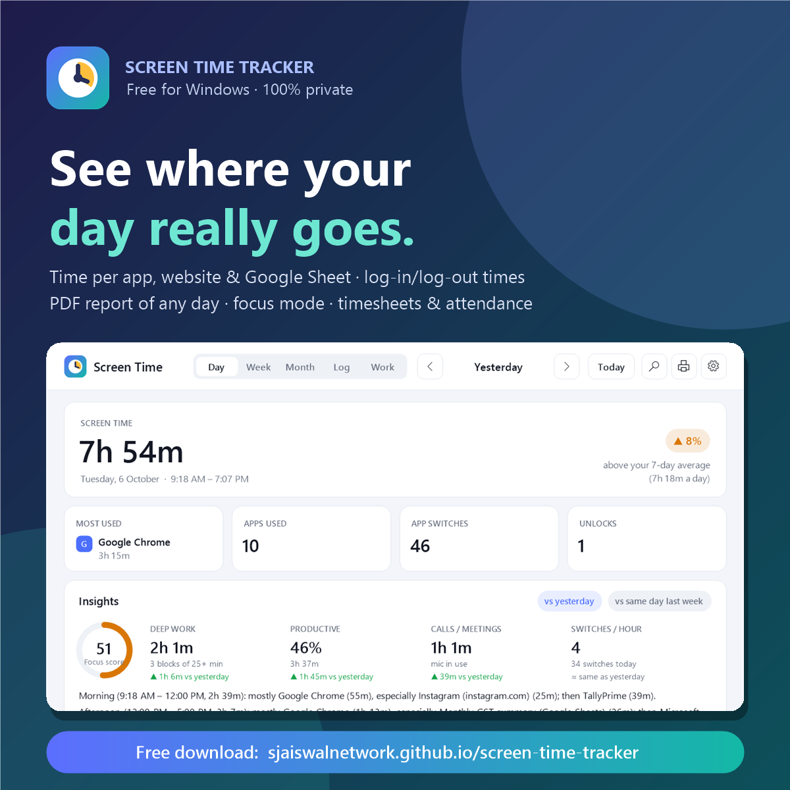

# Share Screen Time Tracker

Like the app? Here's a ready-made post. Copy it, attach the image below, and share it on LinkedIn, WhatsApp or anywhere.

**Link to share:** https://sjaiswalnetwork.github.io/screen-time-tracker/



<sub>Image: `docs/img/linkedin.png` (1200 × 1200). Other good images: `docs/img/wrapped.png`, `docs/img/week.png`.</sub>

---

## LinkedIn post

```text
⏱️ I built a free Screen Time Tracker for Windows – and it's open for everyone.

Our phones tell us exactly how much time we spend on them.
Our PCs – where most of us actually work – tell us nothing.

So I built an app that does. It quietly runs in the background and shows:

✅ Time spent on every app – Chrome, Excel, Tally, WhatsApp, even Calculator
✅ Which website, Google Sheet or file you actually worked on
✅ Your log-in and log-out time every day (synced with internet time)
✅ A clean PDF report of any day, week or month – in one click
✅ A timeline and a full activity log of your day
✅ Focus mode that hides YouTube & Instagram while you work
✅ Hours per client, timesheets and attendance
✅ Gentle reminders for breaks, eye rest and water

🔒 100% private – no account, no cloud. Everything stays on your own PC.
⚡ Installs in under a minute. You choose whether it starts automatically with Windows.

👉 Free download: https://sjaiswalnetwork.github.io/screen-time-tracker/

It's open-source, so anyone can see exactly what it does.
I'd love your feedback – what feature should I add next? 👇

#productivity #windows #opensource #buildinpublic #digitalwellbeing #timemanagement #worksmarter
```

---

## Short version (WhatsApp / X)

```text
I made a free Windows app that shows your screen time per app, website and Google Sheet, your log-in/log-out times, and gives you a PDF report of any day. 100% private – everything stays on your PC.
Download: https://sjaiswalnetwork.github.io/screen-time-tracker/
```
